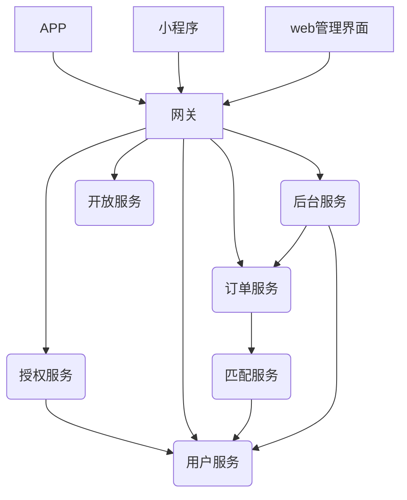

# 设计流程图

```mermaid
graph TD
0[APP] --> A[网关] 
1[小程序] --> A[网关] 
2[web管理界面] --> A[网关] 
A-->B(授权服务)
B-->D
A --> C(后台服务)
A --> D(用户服务)
A --> F(订单服务)
A --> G(开放服务)
E(匹配服务) --> D
C --> D
C --> F
F --> E
```